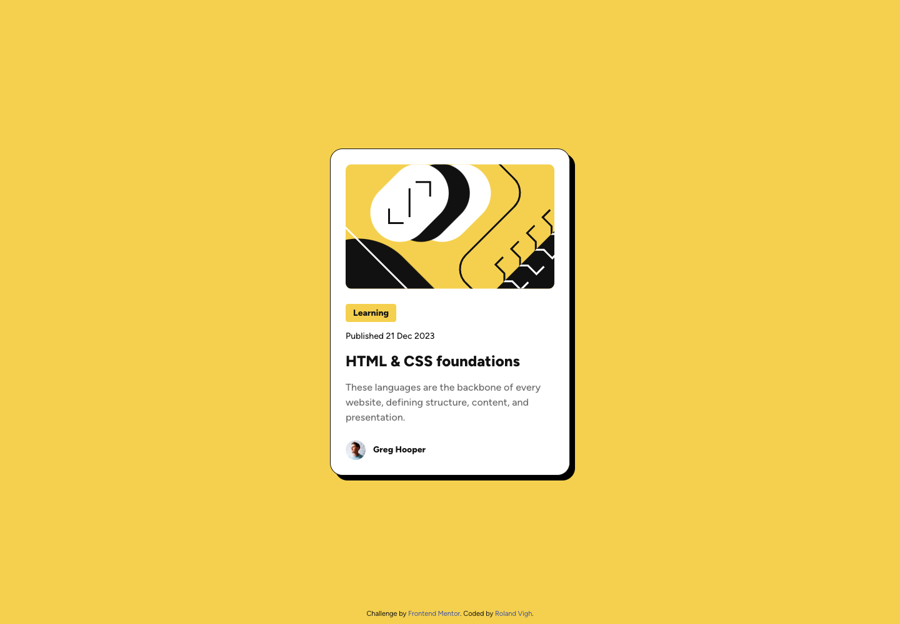
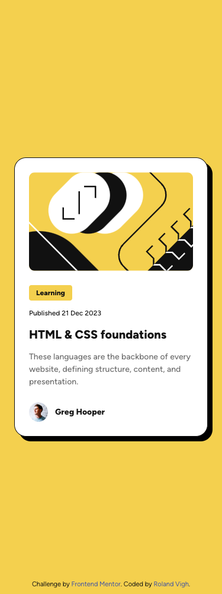

# Frontend Mentor - Blog preview card solution

This is a solution to the [Blog preview card challenge on Frontend Mentor](https://www.frontendmentor.io/challenges/blog-preview-card-ckPaj01IcS). Frontend Mentor challenges help you improve your coding skills by building realistic projects.

## Table of contents

- [Frontend Mentor - QR code component solution](#frontend-mentor---qr-code-component-solution)
  - [Table of contents](#table-of-contents)
  - [Overview](#overview)
    - [Screenshot](#screenshot)
    - [Links](#links)
  - [Author](#author)

## Overview

### Screenshot

Desktop (1440px):

Mobile (375px):

### Links

- Solution URL: [https://github.com/vighgiv/Frontend-Mentor/tree/main/blog-preview-card](https://github.com/vighgiv/Frontend-Mentor/tree/main/blog-preview-card)
- Live Site URL: [https://vighgiv.github.io/Frontend-Mentor/blog-preview-card/index.html](https://vighgiv.github.io/Frontend-Mentor/blog-preview-card/index.html)

## Author

- Email - [rolandvighdev@gmail.com](mailto:rolandvighdev@gmail.com)
- Frontend Mentor - [@vighgiv](https://www.frontendmentor.io/profile/vighgiv)
