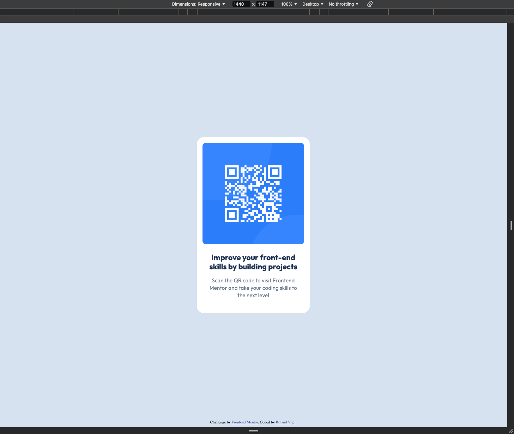
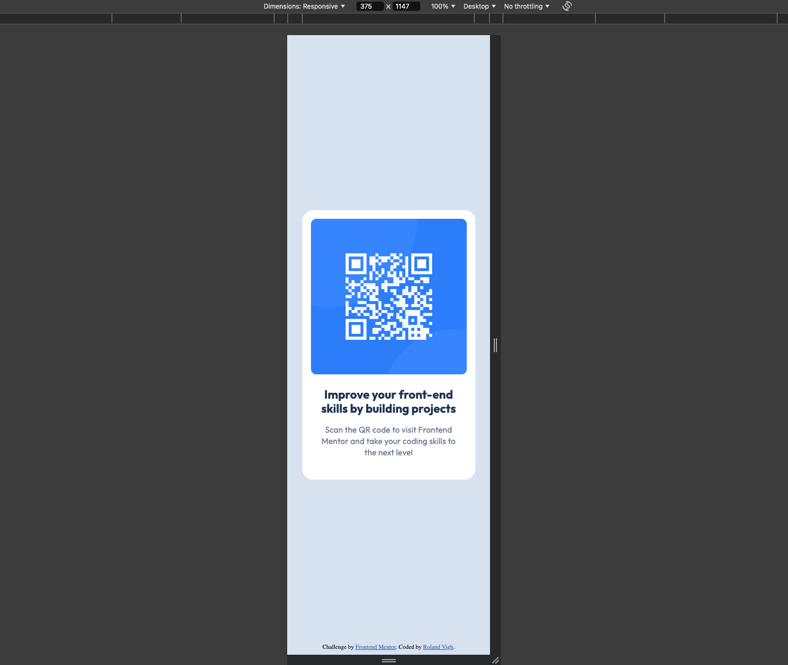

# Frontend Mentor - QR code component solution

This is a solution to the [QR code component challenge on Frontend Mentor](https://www.frontendmentor.io/challenges/qr-code-component-iux_sIO_H). Frontend Mentor challenges help you improve your coding skills by building realistic projects.

## Table of contents

- [Frontend Mentor - QR code component solution](#frontend-mentor---qr-code-component-solution)
  - [Table of contents](#table-of-contents)
  - [Overview](#overview)
    - [Screenshot](#screenshot)
    - [Links](#links)
    - [Notes](#notes)
  - [Author](#author)

**Note: Delete this note and update the table of contents based on what sections you keep.**

## Overview

### Screenshot

Desktop (1440px):

Mobile (375px):

### Notes

I tried to keep it as simple as possible for a tiny project like this. Hence I did not use CSS custom properties for example.

### Links

- Solution URL: [Add solution URL here](https://exmaple.com)
- Live Site URL: [Add live site URL here](https://exmaple.com)

## Author

- Email - [rolandvighdev@gmail.com](mailto:rolandvighdev@gmail.com)
- Frontend Mentor - [@vighgiv](https://www.frontendmentor.io/profile/vighgiv)
